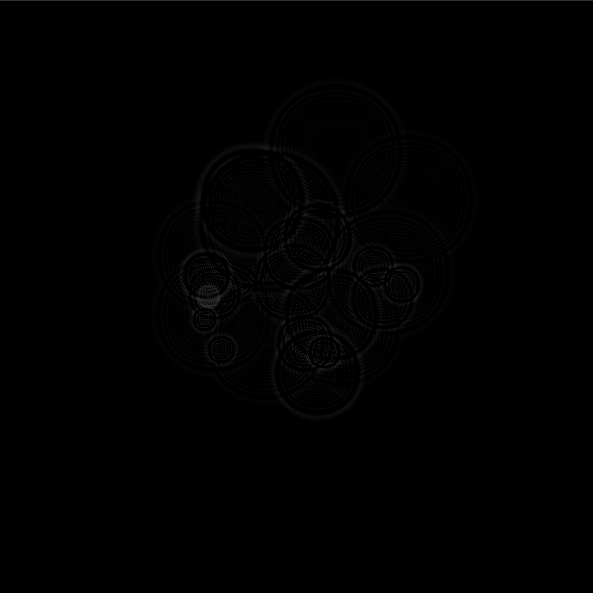

# Wave Equation Visualizer



This is a simple visualizer to practice implementing a basic wave equation

Built with OpenGL, C++, glfw3, Eigen3. Implemented through the compute shader

## Installation

Use git clone to download the project

```bash
git clone git@github.com:faosldkjfhf/wave-equation.git
cd wave-equation
mkdir build
cd build
cmake ..
make -j8
```

## Dependencies

This project requires cmake, Eigen3, glfw3.4, and OpenGL

## Usage

```bash
cd build
./main
```

## Issues

Currently a little dark, need to figure out how to fix
